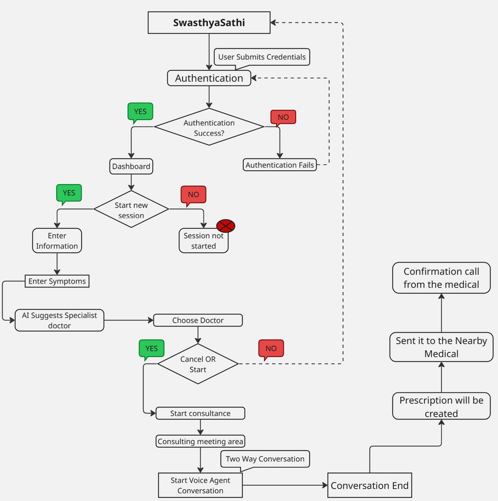
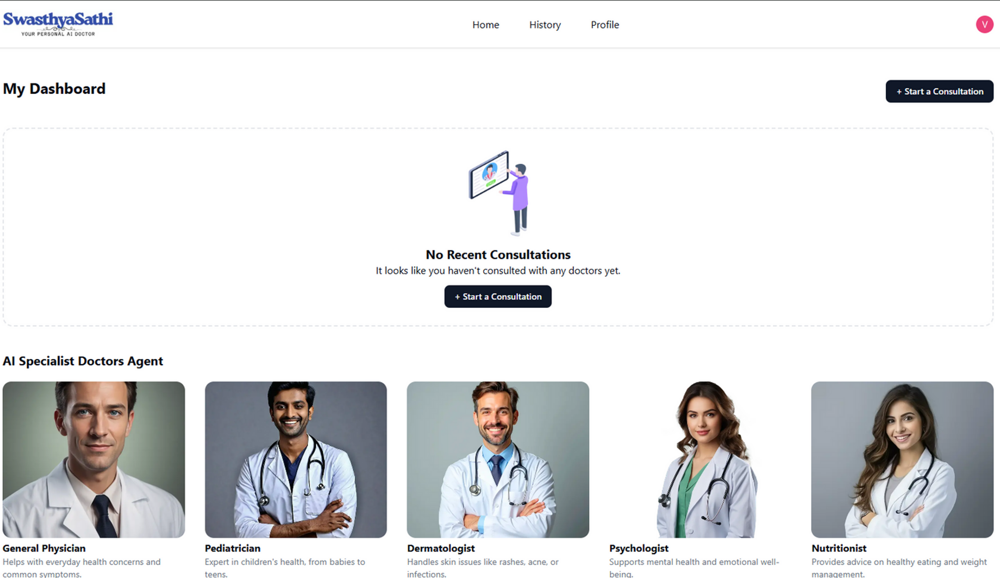

# 🩺 SwasthyaSathi – AI-Powered Virtual Healthcare Platform

SwasthyaSathi is an AI-powered healthcare platform designed to make medical consultations accessible, fast, and reliable—especially for users in remote or underserved areas. The platform enables symptom analysis, smart doctor recommendations, virtual consultations, and digital prescriptions, all without the need for physical travel.

---

## 🚩 Problem Statement
Accessing timely medical care is often hindered by:
* **Geographic Barriers:** Long travel distances to hospitals.
* **Specialist Scarcity:** Lack of specialist availability in rural/remote areas.
* **Time Inefficiency:** Significant delays in consultation and treatment.
* **Administrative Friction:** Inefficient handling of prescriptions and follow-ups.

These challenges often result in delayed diagnosis and worsening health conditions.

## 💡 Proposed Solution
SwasthyaSathi bridges the gap by providing a digital healthcare ecosystem:
* **Natural Language Processing:** Describe symptoms in simple, everyday language.
* **AI Insights:** Get immediate, AI-assisted health preliminary analysis.
* **Smart Matching:** Receive personalized doctor recommendations based on symptoms.
* **Telemedicine:** Consult doctors virtually in real-time.
* **Digital Records:** Access digital prescriptions instantly.

---

## ✨ Key Features

| Feature | Description |
| :--- | :--- |
| **Symptom AI Analysis** | Analyzes plain text input to identify potential health concerns. |
| **Smart Doctor Match** | Suggests relevant medical specialists based on the analyzed symptoms. |
| **Virtual Consultation** | Real-time video/chat consultations assisted by AI insights for the doctor. |
| **Instant Prescriptions** | Automatically generated digital prescriptions (dosage, meds, precautions). |
| **Emergency Handling** | Fast-tracks data sharing with nearby medical stores/hospitals for critical cases. |

---

## 🔄 Architecture Diagram

📌 This diagram illustrates symptom input, AI analysis, doctor recommendation, consultation flow, and prescription generation.

---

## 🖥️ Dashboard

---

## 🛠️ Tech Stack

* **Frontend:** Next.js, Tailwind CSS, Framer Motion
* **Voice AI:** Vapi (Orchestration & Voice Pipeline)
* **Speech-to-Text:** AssemblyAI (Universal Streaming STT)
* **Database & Auth:** Firebase (Firestore & Firebase Auth)
* **Deployment:** Vercel
---

## 📊 Project Highlights
* **Robust Testing:** Validated across 100+ symptom scenarios.
* **Specialty Support:** Supports 15+ medical specialties.
* **Scalability:** Designed with a modular microservices-ready architecture.

## 🚀 Future Enhancements
- [ ] **Localization:** Multi-language support for regional dialects.
- [ ] **Health Trends:** AI-driven long-term health reports and analytics.
- [ ] **Automated Scheduling:** Calendar integration for follow-up reminders.

---

## 🤝 Contribution
Contributions are welcome! 
1. Fork the Project
2. Create your Feature Branch (`git checkout -b feature/AmazingFeature`)
3. Commit your Changes (`git commit -m 'Add some AmazingFeature'`)
4. Push to the Branch (`git push origin feature/AmazingFeature`)
5. Open a Pull Request

---
*⭐ If you find this project useful, consider giving it a star!*
